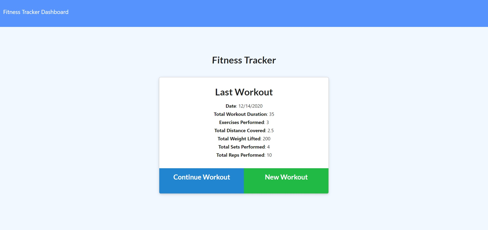
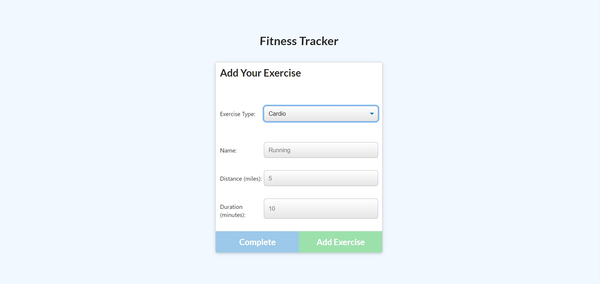
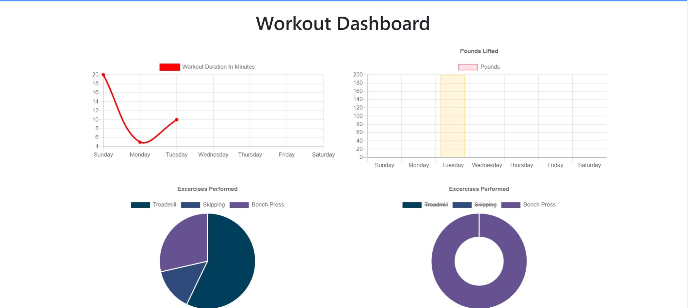

# Workout Tracker

            
## Description

This application is for the fitness freaks that want to improve the quality of their workouts. Workout Tracker allows them to track their workouts. 

Features: 
* Add exercises to a previous workout plan.
* Add new exercises to a new workout plan.
* Graphically view the combined weight of multiple exercises on the stats dashboard.
 

## Table of Contents

[Installation](#installation)  
[Deployment](#deployment)  
[License](#licenses)  
[Contributing](#contributing)                                                               
[Questions](#questions) 

## Installation

1. Create a MongoDB Atlas account
2. Clone this repo.
3. Change mongoose connection details in server.js and seeders/seed.js.
4. Run 'npm i' to install all dependencies.
5. Run 'npm run seed' to view mongo document structure.

## Deployment

<a href="https://ps-workout-tracker.herokuapp.com/"> Workout Tracker (click to view)</a>

             
                
               

## Licenses

The underlying source code used to format and display this content is licensed under the 

## Contributing

Frontend - <a href="https://www.trilogyed.com/">Trilogy Education Services</a>                 
Backend - Prabh Singh

## Questions 

My Github profile is <a href="https://github.com/prabhm512">prabhm512</a>.

If you have any questions regarding this project, please email prabhm512@gmail.com.
